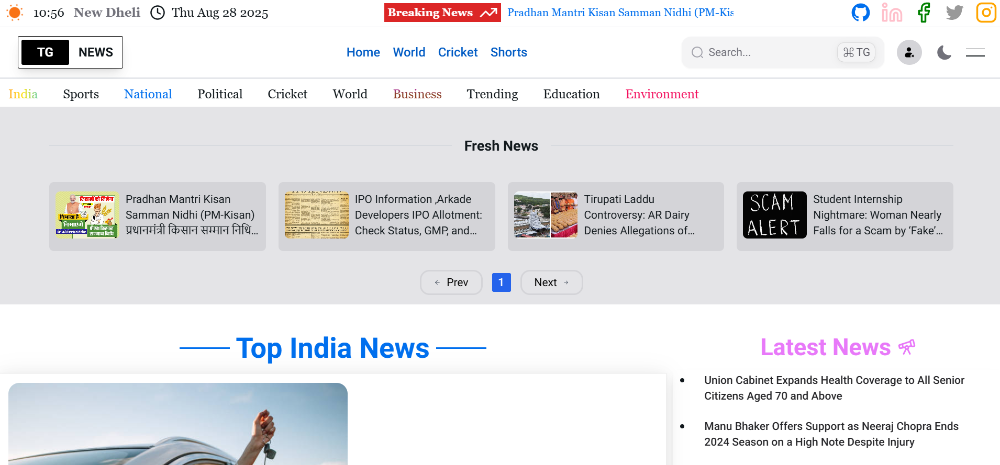
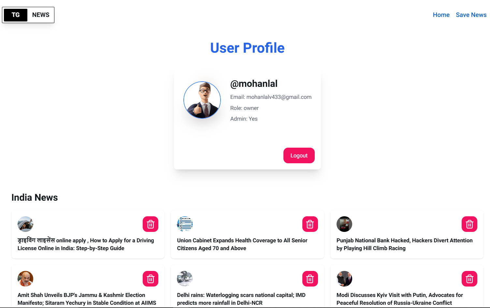

# 📰 Top Global News

A modern **news website** built with **Next.js, Tailwind CSS, and MongoDB**, featuring multiple news categories, **Google authentication**, and an **admin dashboard** for content management. The platform is designed to deliver the latest updates with a secure backend for **news management** and **role-based access control**.

🔗 **Live Website:** [topglobalnews.in](https://topglobalnews.in)

---

## 🚀 Features

- 🌍 Multiple news categories (World, Technology, Sports, Business, etc.)  
- 🛠️ **Admin Dashboard** to manage and publish news articles  
- 📱 Fully responsive and mobile-friendly design  
- ⚡ SEO-optimized with Next.js App Router  
- 🔒 Secure backend integration for user and content management  

---

## 🛠️ Tech Stack

**Frontend:**  
- Next.js 14 (App Router)  
- Tailwind CSS  
- Next/UI Components  

**Backend:**  
- Next.js Api Router
- MongoDB (Mongoose)  

**Authentication:**  
- JWT for secure role-based access  

**Deployment & Tools:**  
- Vercel (Frontend Hosting)  
- GitHub (Version Control)  

---

## 📂 Project Structure
```js
TopGlobalNews/
├── app/ # Next.js App Router pages
├── components/ # Reusable UI components
├── lib/ # Utility functions & helpers
├── models/ # MongoDB models
├── public/ # Static assets
├── styles/ # Global styles (Tailwind configs)

```

## 📸 Screenshots


*Home Page showing top global headlines.*


*Detailed article view with full content.*


*Role-based admin panel secured via JWT.*


*Fully responsive mobile interface.*

